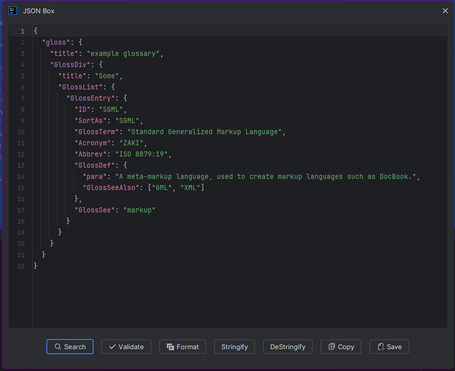

  <picture>
    <source media="(prefers-color-scheme: dark)" srcset="https://github.com/iammohdzaki/JsonBox/blob/main/src/main/resources/META-INF/pluginIconLight.svg">
    
  </picture>

  

<h1 align="center">JsonBox – A Plugin for IntelliJ IDEA</h1>

  Format, validate, minify, and diff JSON directly within your IDE. 
  A fast and lightweight tool for developers working with JSON.

---

<!-- Plugin description -->
**JsonBox** is a smart, floating JSON toolbox built into IntelliJ IDEA. It helps developers format, validate, minify,
copy, and stringify JSON with ease — all inside the IDE.

Whether you're debugging APIs, working with JSON config, or cleaning data, JsonBox helps you work faster with:

- ✨ One-click formatting and minification
- ✅ Structural validation with feedback
- 🔗 Clipboard copy in both pretty and compact formats
- 🔄 Quick diffing support (coming soon)
- 🪟 Non-docked, floating UI accessible from `Tools > Open JsonBox`

<!-- Plugin description end -->

---

## 🚀 Installation

### 🧩 Using the IDE Plugin System

<kbd>Settings/Preferences</kbd> → <kbd>Plugins</kbd> → <kbd>Marketplace</kbd> → <kbd>Search for "JsonBox"</kbd> → <kbd>
Install</kbd>

### 🌐 Using JetBrains Marketplace

Go to [JetBrains Marketplace](https://plugins.jetbrains.com/plugin/MARKETPLACE_ID) and click <kbd>Install to ...</kbd>  
Or download the [latest release](https://plugins.jetbrains.com/plugin/MARKETPLACE_ID/versions) and:

<kbd>Settings/Preferences</kbd> → <kbd>Plugins</kbd> → ⚙️ → <kbd>Install plugin from disk...</kbd>

### 📦 Manually from GitHub

Download from [GitHub Releases](https://github.com/iammohdzaki/JsonBox/releases/latest) and install via:

<kbd>Settings/Preferences</kbd> → <kbd>Plugins</kbd> → ⚙️ → <kbd>Install plugin from disk...</kbd>

---

## 🖼 Plugin Preview

---

## 🧑‍💻 Author

Made with ❤️ by [Mohammad Zaki]. Contributions welcome!

---

Plugin based on the [IntelliJ Platform Plugin Template][template].

[template]: https://github.com/JetBrains/intellij-platform-plugin-template
[docs:plugin-description]: https://plugins.jetbrains.com/docs/intellij/plugin-user-experience.html#plugin-description-and-presentation